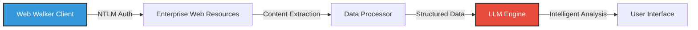
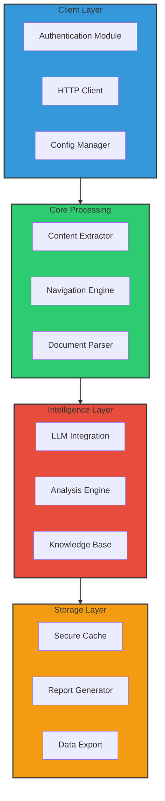

# 🕸️ Web Walker: NTLM+LLM Integration

<div align="center">


[](https://www.python.org/)
[](LICENSE)
[](CONTRIBUTING.md)
[](SECURITY.md)

**Securely navigate and extract intelligence from enterprise web environments**

</div>

## 📋 Table of Contents

- [🌟 Overview](#-overview)
- [✨ Key Features](#-key-features)
- [🔧 Installation](#-installation)
- [🚀 Quick Start](#-quick-start)
- [📘 Usage Examples](#-usage-examples)
- [🏗️ Architecture](#️-architecture)
- [🔐 Security Considerations](#-security-considerations)
- [🛠️ Advanced Configuration](#️-advanced-configuration)
- [📊 Performance](#-performance)
- [🤝 Contributing](#-contributing)
- [📜 License](#-license)

## 🌟 Overview

**Web Walker** combines the power of **NTLM authentication** with **Large Language Models** to create an intelligent web navigation tool specifically designed for enterprise environments. It enables secure access to internal resources while leveraging AI to extract, analyze, and transform content.

<div align="center">



</div>

## ✨ Key Features

### 🔑 Authentication & Security
- **🔐 Seamless NTLM Integration**: Connect to enterprise resources without credential prompts
- **🛡️ Kerberos Support**: Alternative authentication for Active Directory environments
- **🔒 Encrypted Storage**: Secure handling of session data and extracted content
- **👤 SSO Compatibility**: Works with modern Single Sign-On implementations

### 🧠 AI-Powered Analysis
- **📊 Intelligent Data Extraction**: Identify and extract key information from web content
- **🔍 Context-Aware Processing**: Understand document relationships and content hierarchies
- **📝 Automatic Summarization**: Generate concise summaries of lengthy web resources
- **🔄 Format Transformation**: Convert between different document formats and structures

### 🌐 Advanced Navigation
- **🗺️ Site Mapping**: Automatically catalog available resources within a domain
- **🔗 Smart Link Following**: Intelligently navigate complex web applications
- **📚 Content Indexing**: Create searchable indexes of accessed content
- **⏱️ Change Detection**: Identify and highlight changes since previous access

## 🔧 Installation

### Prerequisites
- Python 3.8+
- pip package manager
- Access to enterprise NTLM-protected resources

### Install from PyPI

```bash
pip install web-walker
```

### Install from Source

```bash
# Clone the repository
git clone https://github.com/elithaxxor/web-walker.git
cd web-walker

# Install dependencies
pip install -r requirements.txt

# Install in development mode
pip install -e .
```

<details>
<summary>📋 View dependencies</summary>

```
requests>=2.28.0
requests-ntlm>=1.2.0
beautifulsoup4>=4.11.0
transformers>=4.25.0
torch>=1.13.0
cryptography>=39.0.0
python-dotenv>=0.20.0
tqdm>=4.64.0
```
</details>

## 🚀 Quick Start

### Basic Configuration

Create a `.env` file with your credentials:

```env
# Authentication settings
DOMAIN=CONTOSO
USERNAME=jdoe
PASSWORD=your_secure_password

# LLM settings
MODEL_PATH=./models/enterprise-llm
MAX_TOKEN_LENGTH=2048
```

### Simple Usage Example

```python
from web_walker import WebWalker

# Initialize the walker
walker = WebWalker()

# Navigate to an NTLM-protected resource
content = walker.navigate("https://intranet.company.com/reports/")

# Extract and analyze key information
analysis = walker.analyze(content)

# Print the summary
print(analysis.summary)

# Get structured data
data = analysis.structured_data
print(f"Found {len(data['tables'])} tables and {len(data['links'])} relevant links")
```

## 📘 Usage Examples

### 📊 Extract and Analyze Financial Reports

<div align="center">


</div>

```python
# Extract quarterly financial data from SharePoint
financial_data = walker.extract(
    "https://sharepoint.company.com/finance/quarterly-reports/Q2-2023.xlsx",
    extract_type="table",
    sheet_name="Revenue Summary"
)

# Analyze trends and generate insights
insights = walker.analyze(
    financial_data, 
    analysis_type="financial_trend",
    comparison_periods=["Q1-2023", "Q2-2022"]
)

# Generate executive summary
summary = walker.summarize(insights, audience="executive", max_length=500)
```

### 🔍 Intelligent SharePoint Navigation

```python
# Initialize with SharePoint-specific settings
sharepoint_walker = WebWalker(config="sharepoint_config.yaml")

# Search and extract from multiple document libraries
results = sharepoint_walker.search(
    base_url="https://sharepoint.company.com/sites/ProjectX",
    query="security compliance requirements",
    doc_types=["docx", "pdf", "pptx"],
    max_depth=3,
    date_range=("2023-01-01", "2023-06-30")
)

# Process and consolidate findings
consolidated_report = sharepoint_walker.consolidate(
    results,
    format="markdown",
    organization="by_topic"
)
```

## 🏗️ Architecture

Web Walker follows a modular architecture designed for extensibility and security:

<div align="center">



</div>

### Component Details

| Component | Description | Technologies |
|-----------|-------------|--------------|
| **Authentication Module** | Manages NTLM, Kerberos, and other auth methods | `requests-ntlm`, `gssapi` |
| **HTTP Client** | Handles web requests with proper headers and cookies | `requests`, `aiohttp` |
| **Content Extractor** | Parses HTML/XML/JSON responses | `BeautifulSoup4`, `lxml` |
| **Navigation Engine** | Smart crawling and site mapping | Custom algorithms |
| **LLM Integration** | Connects to language models | `transformers`, `torch` |
| **Analysis Engine** | Processes and analyzes content | Custom ML models |
| **Secure Cache** | Encrypted local storage of sessions | `cryptography` |
| **Report Generator** | Creates formatted reports | `jinja2`, `markdown` |

## 🔐 Security Considerations

Web Walker is designed with enterprise security requirements in mind:

### 🛡️ Authentication Security

- **Zero Credential Storage**: Credentials are never stored in plaintext
- **Token Management**: Secure handling of authentication tokens
- **Session Isolation**: Each instance maintains separate session state
- **Automatic Timeout**: Sessions expire after configurable idle period

### 🔒 Data Protection

<div align="center">

| Data Type | Protection Method | Configuration Option |
|-----------|-------------------|----------------------|
| Credentials | Memory-only / Environment variables | `CREDENTIAL_SOURCE` |
| Session Tokens | Encrypted at rest | `TOKEN_ENCRYPTION_KEY` |
| Extracted Content | Optional encryption | `ENCRYPT_CONTENT` |
| Analysis Results | Access controls | `RESULT_ACCESS_LEVEL` |

</div>

### ⚠️ Important Warnings

> **Enterprise Usage**: Always ensure your use of Web Walker complies with your organization's security policies and data handling procedures.

> **Credential Security**: Use environment variables or secure credential stores rather than hardcoding authentication details.

## 🛠️ Advanced Configuration

### YAML Configuration

Create a `config.yaml` file for advanced settings:

```yaml
authentication:
  method: ntlm  # Options: ntlm, kerberos, oauth
  domain: CONTOSO
  username: ${ENV_USERNAME}  # References environment variable
  password: ${ENV_PASSWORD}
  certificate_path: /path/to/cert.pem  # Optional
  
http:
  timeout: 30
  retries: 3
  user_agent: "WebWalker/1.0 Corporate Browser"
  proxy: "http://proxy.company.com:8080"
  
llm:
  model: "enterprise-llm-v2"
  context_length: 4096
  temperature: 0.7
  top_p: 0.95
  cache_dir: "/path/to/secure/cache"
  
extraction:
  default_format: "markdown"
  extract_tables: true
  extract_images: false
  max_depth: 3
  follow_external_links: false
```

### API Reference

<details>
<summary>WebWalker Class</summary>

```python
class WebWalker:
    def __init__(self, config_path=None, env_file=None):
        """Initialize with optional config file and .env file"""
        
    def navigate(self, url, method="GET", data=None, headers=None):
        """Navigate to a URL using NTLM authentication"""
        
    def extract(self, content, extract_type="text", **options):
        """Extract specific content types from a page"""
        
    def analyze(self, content, analysis_type="general", **options):
        """Analyze content using the LLM"""
        
    def summarize(self, content, max_length=1000, format="text"):
        """Generate a summary of the content"""
        
    def search(self, base_url, query, **options):
        """Search for content within a site"""
        
    def map_site(self, base_url, max_depth=2, **options):
        """Generate a map of the site structure"""
        
    def export(self, data, format="json", path=None):
        """Export data to a file"""
```
</details>

## 📊 Performance

Web Walker is optimized for enterprise environments:

### Benchmarks

<div align="center">

| Operation | Average Time | Memory Usage | Notes |
|-----------|--------------|--------------|-------|
| Initial Authentication | 1.2s | 15MB | First-time connection |
| Subsequent Requests | 0.3s | 5MB | Using cached auth |
| Document Extraction (10 pages) | 2.5s | 40MB | HTML content |
| LLM Analysis (standard) | 3.7s | 1.2GB | Using local model |
| LLM Analysis (complex) | 8.2s | 2.1GB | With deep context |
| Site Mapping (100 URLs) | 45s | 120MB | Breadth-first crawl |

</div>

### Optimization Tips

- **📦 Use Caching**: Enable the document cache for repeated access patterns
- **🔍 Limit Extraction Scope**: Specify exact elements to extract rather than whole pages
- **⚡ Batch Processing**: Use the batch API for multiple document analysis
- **🧠 Model Selection**: Choose smaller LLMs for faster but less detailed analysis
- **📑 Pagination Handling**: Configure optimal page size for large document libraries

## 🤝 Contributing

Contributions to Web Walker are welcome! Please see our [Contributing Guidelines](CONTRIBUTING.md) for more details.

### Development Setup

```bash
# Clone the repo
git clone https://github.com/elithaxxor/web-walker.git
cd web-walker

# Create virtual environment
python -m venv venv
source venv/bin/activate  # On Windows: venv\Scripts\activate

# Install dev dependencies
pip install -r requirements-dev.txt

# Run tests
pytest tests/
```

### Code Standards

- We follow PEP 8 style guidelines
- All code must pass linting via `flake8`
- New features should include appropriate tests
- Documentation must be updated for API changes

## 📜 License

This project is licensed under the MIT License - see the [LICENSE](LICENSE) file for details.

---

<div align="center">

**[Documentation](https://web-walker.readthedocs.io)** | 
**[Report Bug](https://github.com/elithaxxor/web-walker/issues)** | 
**[Request Feature](https://github.com/elithaxxor/web-walker/issues)**

<p align="center">
Made with ❤️ by the Web Walker Team
</p>

<p align="center">
⭐ Star this repo if you found it useful! ⭐
</p>

</div>
