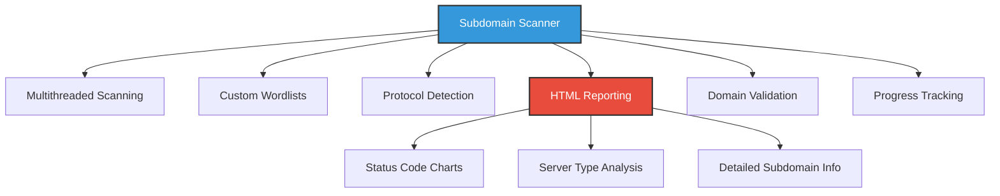
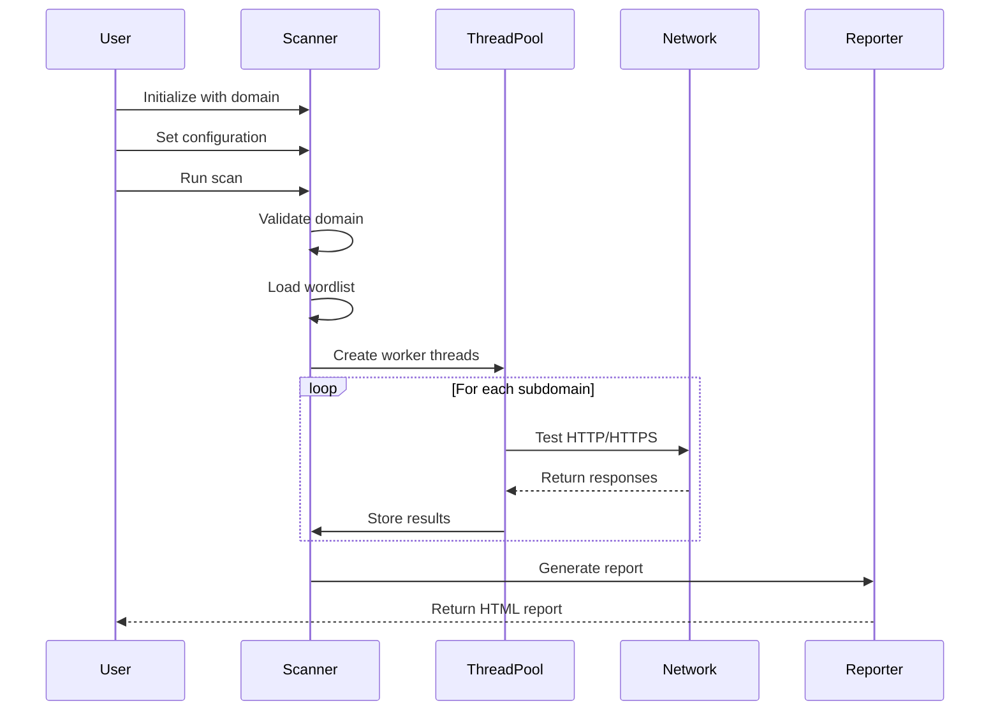

# 🔍 Subdomain Scanner

<div align="center">


[](https://www.python.org/)
[](LICENSE)
[](https://github.com/elithaxxor/web-walker)

**Discover and analyze subdomains with powerful visualization capabilities**

</div>

<p align="center">
This powerful tool scans subdomains of a target domain and generates comprehensive HTML reports with interactive charts and detailed analysis. Perfect for security researchers, penetration testers, and network administrators.
</p>

---

## 📋 Table of Contents

- [✨ Features](#-features)
- [🖼️ Screenshots](#-screenshots)
- [⚙️ Installation](#-installation)
- [🚀 Usage](#-usage)
- [🔧 Configuration](#-configuration)
- [📊 Report Details](#-report-details)
- [🏗️ Project Structure](#-project-structure)
- [⚡ How It Works](#-how-it-works)
- [🤝 Contributing](#-contributing)
- [📜 License](#-license)
- [👤 Author](#-author)

---

## ✨ Features

<div align="center">



</div>

- **🚀 High-Performance Scanning**: Utilizes multithreading for rapid subdomain discovery
- **📊 Visual Reporting**: Generates interactive HTML reports with charts and graphs
- **🔍 Comprehensive Analysis**: Captures HTTP status codes, server types, and response details
- **🔄 Protocol Detection**: Automatically tests both HTTP and HTTPS protocols
- **📋 Custom Wordlists**: Supports custom subdomain wordlists for targeted scanning
- **⏱️ Progress Tracking**: Real-time scan progress with ETA using tqdm
- **✅ Input Validation**: Built-in domain validation to prevent scanning errors
- **🎨 Colorized Output**: Terminal-friendly colorized output for better readability
- **📱 Responsive Reports**: Generated reports work on both desktop and mobile devices
- **🔒 Security Focused**: Designed with security research and assessment in mind

---

## 🖼️ Screenshots

<div align="center">
  <p><strong>Interactive HTML Report with Status Code Distribution</strong></p>
  
  
  <p><strong>Server Type Analysis</strong></p>
  
  
  <p><strong>Detailed Subdomain Listing</strong></p>
  
</div>

---

## ⚙️ Installation

### Prerequisites

- Python 3.x
- pip package manager

### Installation Steps

1. **Clone the repository**:
   ```bash
   git clone https://github.com/elithaxxor/web-walker.git
   cd web-walker/sub-domainer_V2
   ```

2. **Install required packages**:
   ```bash
   pip install -r requirements.txt
   ```

<details>
<summary>📦 View dependencies</summary>

```
requests>=2.28.1
colorama>=0.4.5
tqdm>=4.64.0
validators>=0.20.0
beautifulsoup4>=4.11.1
jinja2>=3.1.2
```
</details>

---

## 🚀 Usage

### Basic Usage

Run the script with a target domain:

```bash
python sub-domainer_V2+Results.py
```

The script will prompt you for:
- Target domain name
- Optional custom wordlist file
- Output report filename

### Command Line Arguments (Coming Soon)

```bash
python sub-domainer_V2+Results.py --domain example.com --wordlist subdomains.txt --output report.html --threads 20
```

### Using as a Module

```python
from subdomain_scanner import SubdomainScanner

# Initialize the scanner
scanner = SubdomainScanner("example.com", filename="subdomains.txt")

# Set output report file
scanner.set_report_file("example_com_report.html")

# Run the scan
results = scanner.run()

# Access scan results programmatically
for subdomain, data in results.items():
    print(f"{subdomain}: Status {data['status']}, Server: {data['server']}")
```

---

## 🔧 Configuration

### Wordlist Configuration

The scanner can use either the built-in wordlist or a custom one:

- **Default wordlist**: Built into the scanner with common subdomain names
- **Custom wordlist**: Provide a text file with one subdomain per line

### Scanner Options

| Option | Description | Default |
|--------|-------------|---------|
| `threads` | Number of concurrent scanning threads | 10 |
| `timeout` | Request timeout in seconds | 5 |
| `user_agent` | Custom User-Agent string | Mozilla/5.0 |
| `protocols` | Protocols to test | HTTP, HTTPS |
| `retry_count` | Number of retry attempts | 2 |
| `verify_ssl` | Verify SSL certificates | True |

---

## 📊 Report Details

The HTML report includes comprehensive information about the scan:

### Summary Section

- **📊 Total Subdomains**: Number of subdomains scanned
- **✅ Discovered Subdomains**: Number of valid subdomains found
- **⏱️ Scan Duration**: Total time taken for scanning
- **📅 Scan Date**: Date and time of the scan

### Visual Charts

- **HTTP Status Distribution**: Pie chart showing distribution of HTTP status codes
- **Server Type Analysis**: Breakdown of different server types discovered
- **Response Time Analysis**: Performance metrics for subdomain responses

### Detailed Results Table

| Column | Description |
|--------|-------------|
| Subdomain | Full subdomain name |
| Status Code | HTTP status code (200, 404, etc.) |
| Server | Server type (Apache, Nginx, etc.) |
| Protocol | Protocol used (HTTP/HTTPS) |
| Response Time | Time taken to respond (ms) |
| Content Length | Size of response content |
| Redirect URL | Destination URL if redirected |

---

## 🏗️ Project Structure

```
sub-domainer_V2/
├── sub-domainer_V2+Results.py    # Main scanner script
├── requirements.txt              # Required dependencies
├── templates/                    # HTML report templates
│   └── report_template.html      # Jinja2 template for reports
├── wordlists/                    # Subdomain wordlists
│   ├── default.txt               # Default wordlist
│   └── custom/                   # Directory for custom wordlists
└── reports/                      # Generated scan reports
```

---

## ⚡ How It Works

<div align="center">



</div>

1. **Initialization**: The scanner is initialized with a target domain and configuration options
2. **Validation**: Domain is validated to ensure it's properly formatted
3. **Wordlist Loading**: Default or custom subdomain wordlist is loaded
4. **Thread Pool Creation**: Worker threads are created for concurrent scanning
5. **Subdomain Testing**: Each subdomain is tested with both HTTP and HTTPS
6. **Data Collection**: Response data is collected, including status codes and server information
7. **Analysis**: Collected data is analyzed for patterns and statistics
8. **Report Generation**: A comprehensive HTML report is generated with visualizations
9. **Results Presentation**: Terminal output and HTML report provide scan results

---

## 🤝 Contributing

Contributions are welcome! Here's how you can help:

1. **Fork the Repository**: Create your own fork of the project
2. **Create a Feature Branch**: `git checkout -b feature/amazing-feature`
3. **Make Your Changes**: Add your improvements or fixes
4. **Run Tests**: Ensure all tests pass
5. **Commit Changes**: `git commit -m 'Add some amazing feature'`
6. **Push to Branch**: `git push origin feature/amazing-feature`
7. **Open a Pull Request**: Submit your changes for review

### 💡 Feature Ideas

- 📱 Mobile app interface
- 🔄 Continuous monitoring mode
- 📊 Export to different report formats (PDF, CSV)
- 🌐 Integration with other security tools
- 🔍 Advanced fingerprinting capabilities
- 🔐 Vulnerability scanning for discovered subdomains

---

## 📜 License

This project is licensed under the MIT License - see the [LICENSE](LICENSE) file for details.

---

## 👤 Author

<div align="center">
  
**Created by [elithaxxor](https://github.com/elithaxxor)**

[](https://github.com/elithaxxor)
[](https://twitter.com/elithaxxor)

<p>Created with ❤️ for the security research community</p>

</div>

---

<div align="center">

**[Documentation](https://github.com/elithaxxor/web-walker/wiki)** | 
**[Report Bug](https://github.com/elithaxxor/web-walker/issues)** | 
**[Request Feature](https://github.com/elithaxxor/web-walker/issues)**

<p align="center">
Last updated: April 7, 2025
</p>

</div>
